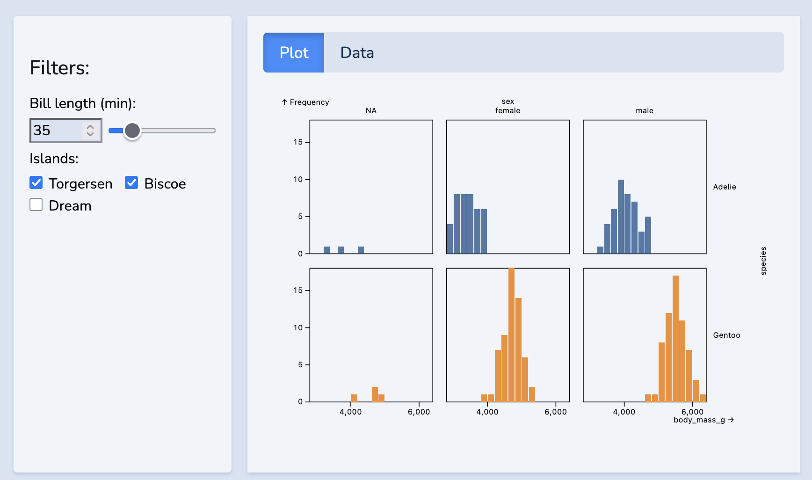

[](#final-result)

> Final Result - A Two Pannel Display with user interactivity and live graph updates!

Let's use ObservableJS to make some interaction! You might recognize the name Observable for their word on the D3 graphing package framework or their data platform. They make a lot of cool stuff, and Quarto allows us to use some of their work to make interactive components on web pages!

## Quick Overview:

#### 1. Observable cells:

You can make Observable cells in your quarto document by using `{ojs}`, for example, it can do math:

```{ojs}
//| echo: fenced
5 + 5
```

#### 2. Importing Data:

We can import data using [`FileAttachment`](https://observablehq.com/documentation/data/files/file-attachments#csv-files). Let's use that to load the classic Palmer Penguins data:

```{ojs}
//| echo: fenced
pdata = FileAttachment("palmer-penguins.csv").csv({typed: true})
```

#### 3. User Inputs:

What is [`viewof`](https://observablehq.com/@observablehq/a-brief-introduction-to-viewof)

```{ojs}
//| echo: fenced
viewof mynum = Inputs.range(
  [1, 50], 
  {value: 35, step: 1, label: "Pick a Number!"}
)
//print mynum
```

::: {.card .mt-3 .p-2}
```{ojs}
mynum
```
:::

## Plotting

-   [Plot Documentation](https://observablehq.com/plot/features/plots)

`Plot` is the main canvas when graphing:

```{ojs}
//| echo: fenced
Plot.plot({
  marks: [
    Plot.frame(), // Creates outline
    Plot.text(["Hello, world! This is our canvas!"], {frameAnchor: "middle"})
  ]
})
```

Let's make some data for us to graph:

```{ojs}
//| echo: fenced
aal = FileAttachment("AAL.csv").csv({typed: true}) // American Airlines
```

Now, we cane make a simple graph using the same `Plot.plot({marks:[]})`. This time, let's make a Line graph as our mark:

```{ojs}
//| echo: fenced
Plot.plot({
  marks: [
    Plot.lineY(aal, {x: "Date", y: "Close"})
  ]
})
```

## Making a Two Pannel Display:

I'm going to use the code found [in their example](https://github.com/quarto-dev/quarto-web/blob/main/docs/interactive/ojs/ojs-cells.qmd) as a base, but adjust the code to make it more visually appealing. Part of this is to accomodate the fact that I am using the [morph bootswatch theme](https://bootswatch.com/morph/) which has some ugly defaults.

First, Let's go ahead and figure out a [general pannel design](https://quarto.org/docs/interactive/layout.html#sidebar-panel) using `.panel-sidebar` and `.panel-fill`:

##### **Out of the Box:**

::: panel-sidebar
#### Side Panel:

Code inside the `.panel-sidebar` goes here on the left.
:::

::: panel-fill
#### Main Pannel:

Code inside the `.panel-fill` goes here on the right. I'm going to go ahead and add an image from Google so we can get the feel for what this might look like.

{height="300"}
:::

Out of the box, the sidebar panned gets the light background and a drop shadow from the morph theme to make it look recessed. Annoyingly, the content side panel just uses the general background color. This might the the desired effect for some use cases, but I find it kind of distracting.

I think the following fixes will make it look better:

#### 1. Horizontal Padding:

Especially on the side panel, the text is too close to the side. We can add horizontal padding using `.px`, which can take a number 1 through 5 (i.e. \`.px-5').

#### 2. Vertical Padding:

While we're at it, let's also add some vertical padding. Because I'm using a header, the vertical padding isn't too bad, but normal text, the it was also far to close to the top edge. We can add vertical padding in a similar way to horizontal padding, except with `.py`

#### 3. Drop the Shadow (Pun Intended):

Let's also adjust the current shadow. I'm going to replace it with a small shadow from Bootswatch: `.shadow-sm`

#### 4. Margins:

I'm also going to adjust the left margin on the content panel to increase the space between the two panels. This can be down with `.ml` (Margin Left).

##### **Updated Version:**

Here is the pannel layout with the properties described above!

::: {.panel-sidebar .px-3 .py-3 .shadow-sm}
#### CSS Properties:

```         
.px-3 
.py-3 
.shadow-sm
```
:::

::: {.panel-fill .px-3 .py-3 .ml-2}
#### CSS Properties:

```         
.px-3 
.py-3 
.ml-2
```
:::

##### **Light Background:**

Here is a version where I make the right side have the light background color:

::: {.panel-sidebar .px-3 .py-3 .shadow-sm}
#### CSS Properties:

```         
.px-3 
.py-3 
.shadow-sm
```
:::

::: {.panel-fill .px-3 .py-3 .ml-2 .bg-light .shadow-sm}
#### CSS Properties:

```         
.px-3 
.py-3 
.shadow-sm
.bg-light
```
:::

## Final Result:

Here is the final result! The final display also uses tabs to not only show the plots but the raw data. I did make some changes to CSS to remove the shadow on the tabs, which you can [find here](https://github.com/cooper-richason/blog/blob/main/theme.scss)

::: {.panel-sidebar .py-3 .px-3 .mb-4 .border .bg-light .shadow-sm .round fig-align="center"}
#### Filters:

```{ojs}

viewof bill_length_min = Inputs.range(
  [32, 50], 
  {value: 35, step: 1, label: "Bill length (min):"}
)
viewof islands = Inputs.checkbox(
  ["Torgersen", "Biscoe", "Dream"], 
  { value: ["Torgersen", "Biscoe"], 
    label: "Islands:"
  }
)
```
:::

:::: {.panel-fill .py-3 .px-3 .mb-4 .border .bg-light .shadow-sm fig-align="center"}
::: panel-tabset
## Plot

```{ojs}

//| echo: false
filtered = pdata.filter(function(penguin) {
  return bill_length_min < penguin.bill_length_mm &&
         islands.includes(penguin.island);
})

Plot.rectY(filtered, 
  Plot.binX(
    {y: "count"}, 
    {x: "body_mass_g", fill: "species", thresholds: 20}
  ))
  .plot({
    facet: {
      data: filtered,
      x: "sex",
      y: "species",
      marginRight: 80
    },
    marks: [
      Plot.frame(),
    ]
  }
)
```

## Data

```{ojs}
Inputs.table(filtered)
```
:::
::::